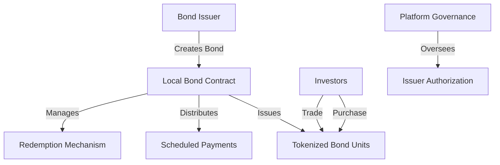

# Local Model: Decentralized Bond Platform

A comprehensive smart contract platform for issuing and managing digital bonds on the Stacks blockchain. Local Model empowers organizations and investors with a flexible, transparent, and secure bond issuance ecosystem.

## Overview

Local Model transforms traditional bond markets through blockchain technology, providing:

- **Dynamic Bond Lifecycle Management**: From creation to redemption
- **Flexible Bond Configurations**: Adaptable interest rates, schedules, and denominations
- **Seamless Market Interactions**: Integrated primary and secondary trading
- **Automated Financial Workflows**: Programmatic interest and principal distributions
- **Immutable Transparency**: Verifiable ownership and transaction records

## Architecture

The platform leverages a modular smart contract architecture to manage the entire bond lifecycle.



### Core Components:
- Decentralized Bond Issuance
- Investor Portfolio Tracking
- Programmable Payment Mechanisms
- Secure Trading Infrastructure
- Flexible Redemption Protocols

## Contract Documentation

### Core Functions

#### Bond Issuance
- `create-bond`: Initialize new bond with custom parameters
- `add-bond-issuer`: Grant issuer permissions
- `remove-bond-issuer`: Revoke issuer access

#### Investment Mechanisms
- `purchase-bonds`: Acquire bonds in primary market
- `transfer`: Trade bonds in secondary market
- `get-balance`: Query bond portfolio

#### Financial Workflows
- `fund-interest-payments`: Allocate interest reserves
- `claim-interest`: Distribute periodic returns
- `redeem-bonds`: Settle mature bond positions
- `early-redemption`: Flexible redemption options

### Governance Roles
- Platform Administrator: Manages system-level permissions
- Authorized Issuers: Create and configure bond offerings
- Investors: Participate in bond markets and manage investments

## Getting Started

### Prerequisites
- Clarinet
- Stacks Wallet
- STX tokens for transactions

### Usage Examples

1. Creating a Bond
```clarity
(contract-call? .blockbond create-bond
    u1000000000 ;; total face value
    u1000000    ;; denomination
    u500        ;; 5% interest rate
    u144        ;; payment frequency (blocks)
    u52560      ;; maturity (~ 1 year in blocks)
    false       ;; early redemption not allowed
)
```

2. Purchasing Bonds
```clarity
(contract-call? .blockbond purchase-bonds
    u1          ;; bond ID
    u5          ;; units to purchase
    none        ;; recipient (optional)
)
```

3. Claiming Interest
```clarity
(contract-call? .blockbond claim-interest u1)
```

## Function Reference

### Bond Management
```clarity
(create-bond (total-face-value uint) (denomination uint) (interest-rate uint) 
            (payment-frequency uint) (maturity-blocks uint) (allow-early-redemption bool))
```

### Trading Operations
```clarity
(purchase-bonds (bond-id uint) (units uint) (recipient (optional principal)))
(transfer (bond-id uint) (amount uint) (recipient principal))
```

### Financial Operations
```clarity
(fund-interest-payments (bond-id uint) (amount uint))
(claim-interest (bond-id uint))
(redeem-bonds (bond-id uint))
```

## Development

### Testing
1. Clone the repository
2. Install Clarinet
3. Run tests:
```bash
clarinet test
```

### Local Development
1. Start Clarinet console:
```bash
clarinet console
```
2. Deploy contract:
```clarity
(contract-call? .blockbond ...)
```

## Security Considerations

### Key Safety Measures
- Access control for administrative functions
- Input validation for all operations
- Balance checks before transfers
- Maturity verification for redemptions

### Limitations
- Interest rates are fixed at issuance
- No support for variable rate bonds
- Early redemption must be enabled at creation
- All operations in STX tokens only

### Best Practices
- Always verify bond parameters before purchase
- Monitor interest payment schedules
- Maintain sufficient STX balance for operations
- Review bond terms thoroughly before investing